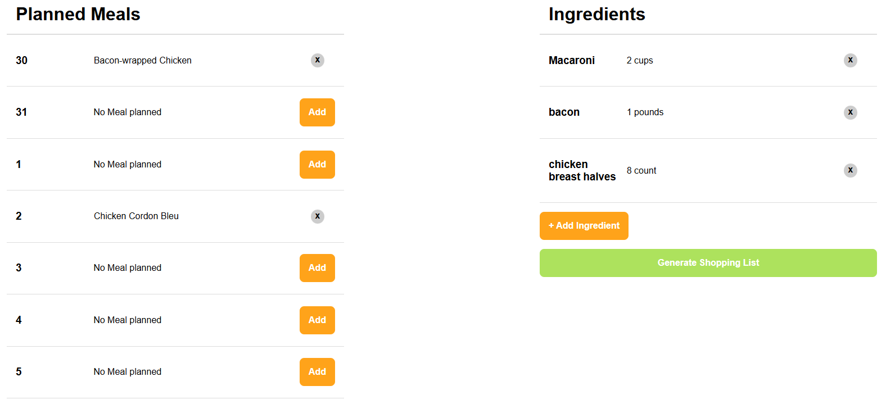
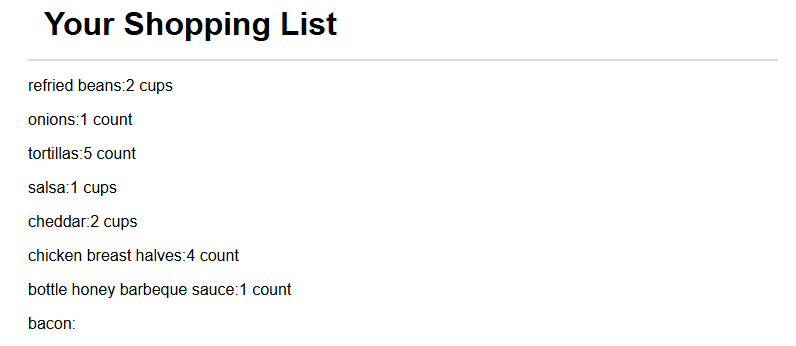

# Meal Tracker with Angular
Full-stack application to help you plan and manage your meals, ingredients, and recipes efficiently. 
Built with a robust backend using MongoDB, and a dynamic frontend, Meal Tracker ensures a seamless experience for users looking to organize their culinary activities.

### What can do?
- Search and add meals for the week
- Add ingredients, have track and manage them
- View the shopping list od missing ingredients for the added meals

<p align="center" style="margin-bottom: 0px !important;">
  
</p>
<p align="center" style="margin-bottom: 0px !important;">
  
</p>

## FRONTEND
## Build
Run ```ng build``` to build the project. The build artifacts will be stored in the ```dist/``` directory.

## Start the application
Run ```npm run start```, then navigate to ```http://localhost:4200/```. <br>
The app will automatically reload if you change any of the source files.

## Version
This project was generated with Angular version 18.2.9

## BACKEND
## Creation of the database
Run the following commands in the backend terminal to create and fill the database with the base info, the recipes: <br>
1. Convert raw data into recipes.json file ```node src/convert-to-json.js```
2. Start running MongoDB ```mongod```
3. Import the generated recipes to a DB called **meal-tracker** <br> ```mongoimport --db=”meal-tracker” --collection=”recipes” --file=”./recipes.json” --jsonArray```

## Start the server
Run ```npm run start``` <br>
The server will automatically reload if you change any of the source files.
